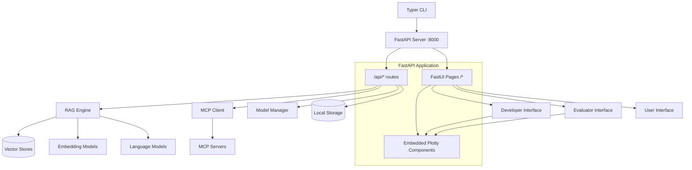
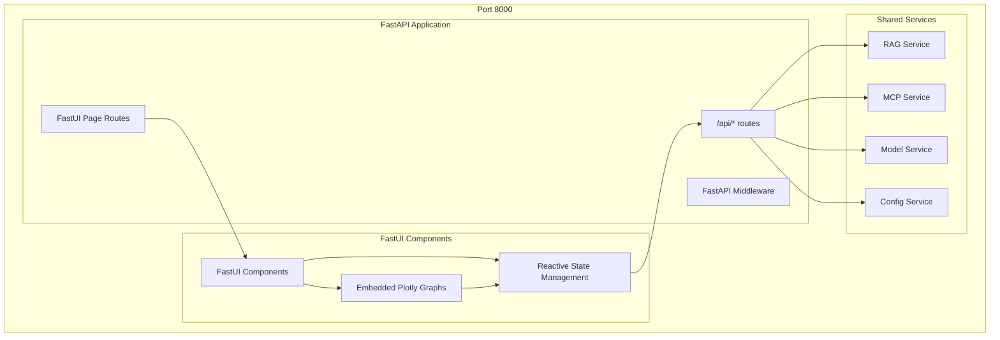
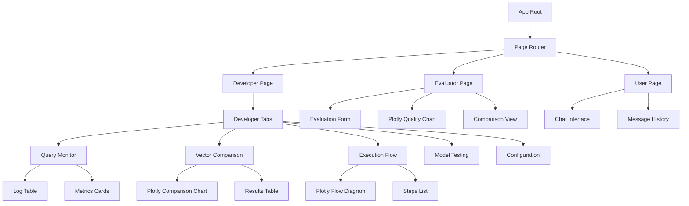

# Design Document

## Overview

AI Studio는 FastUI와 Plotly를 통합한 현대적인 웹 애플리케이션으로, RAG와 MCP를 통합하여 AI 개발자, 평가자, 사용자에게 차별화된 인터페이스를 제공합니다. 시스템은 FastAPI 기반 아키텍처로 구성되어 FastUI가 모든 UI 객체와 리소스를 관리하고, Plotly가 그래픽과 사용자 상호작용을 담당합니다. uv 패키지 관리와 Typer CLI를 통해 실행됩니다.

## Architecture

### High-Level Architecture



### FastUI + Plotly Architecture



## Components and Interfaces

### 1. CLI Interface (Typer)

**Purpose**: 애플리케이션 진입점 및 관리 인터페이스

**Key Components**:
- `studio.main`: 유일한 메인 진입점 (다른 main.py 파일 금지)
- `studio.cli.commands`: 서브커맨드 구현
- `studio.cli.config`: 설정 관리

**Interface**:
```python
@app.command()
def run(
    host: str = "localhost",
    port: int = 8050,
    debug: bool = False
) -> None:
    """Run the AI Studio web interface"""
    
@app.command()
def config(
    api_key: Optional[str] = None,
    model: Optional[str] = None
) -> None:
    """Configure API keys and models"""
```

### 2. FastUI Server Integration

**Purpose**: FastAPI 기반 서버에서 FastUI 컴포넌트와 Plotly 그래프를 통합 제공

**Key Components**:
- `studio.server.app`: FastAPI 서버 애플리케이션 (main.py 사용 금지)
- `studio.server.fastapi_app`: FastAPI 애플리케이션 인스턴스
- `studio.frontend.fastui_app`: FastUI 페이지 및 컴포넌트
- `studio.frontend.plotly_integration`: Plotly-FastUI 통합 로직

**Server Integration**:
```python
# studio/main.py - 유일한 메인 진입점
import typer
from app.server.app import create_app
from app.cli.commands import run_server

app = typer.Typer()

@app.command()
def run(host: str = "localhost", port: int = 8000, debug: bool = False):
    """Run the AI Studio FastUI application"""
    run_server(host, port, debug)

if __name__ == "__main__":
    app()

# studio/server/app.py - FastAPI 애플리케이션 (main.py 아님)
from fastapi import FastAPI
from fastui import FastUI, AnyComponent, prebuilt_html
from fastui.components import Page, Heading, Paragraph
import plotly.graph_objects as go
import plotly.io as pio

def create_app() -> FastAPI:
    """Create and configure FastAPI application"""
    app = FastAPI(title="AI Studio")

    # API 라우트 등록
    @app.get("/api/health")
    async def health_check():
        return {"status": "healthy"}

    # FastUI 페이지 라우트
    @app.get("/", response_model=FastUI, response_model_exclude_none=True)
    async def homepage() -> list[AnyComponent]:
        return [
            Page(
                components=[
                    Heading(text='AI Studio', level=1),
                    Paragraph(text='FastUI + Plotly Integration'),
                ]
            ),
        ]

    # HTML 엔드포인트 (FastUI 렌더링용)
    @app.get('/{path:path}')
    async def html_landing() -> HTMLResponse:
        return HTMLResponse(prebuilt_html(title='AI Studio'))
    
    return app
```

### 3. FastAPI Backend

**Purpose**: RESTful API 엔드포인트 및 비동기 서비스 제공

**Key Components**:
- `studio.api.routes`: API 라우트 정의
- `studio.api.models`: Pydantic 모델
- `studio.api.dependencies`: 의존성 주입
- `studio.api.middleware`: 미들웨어 설정

**API Routes**:
```python
# RAG API
@router.post("/api/rag/query")
async def rag_query(request: RAGQueryRequest) -> RAGResponse:
    """Execute RAG query"""

@router.post("/api/rag/compare")
async def compare_vector_stores(request: CompareRequest) -> VectorStoreComparison:
    """Compare vector store performance"""

# MCP API
@router.get("/api/mcp/tools")
async def list_mcp_tools() -> List[MCPTool]:
    """List available MCP tools"""

@router.post("/api/mcp/execute")
async def execute_mcp_tool(request: MCPExecuteRequest) -> MCPResult:
    """Execute MCP tool"""

# Model API
@router.post("/api/models/test")
async def test_models(request: ModelTestRequest) -> ModelComparison:
    """Test multiple models"""
```

### 4. FastUI Frontend with Plotly Integration

**Purpose**: 역할별 차별화된 웹 인터페이스를 FastUI 컴포넌트로 제공

**Key Components**:
- `studio.frontend.app`: FastUI 애플리케이션 메인
- `studio.frontend.pages`: 역할별 페이지 라우트
- `studio.frontend.components`: 재사용 가능한 FastUI 컴포넌트
- `studio.frontend.plotly_components`: Plotly 통합 컴포넌트

**FastUI-API Integration**:
```python
from fastui import FastUI, AnyComponent
from fastui.components import Page, Form, Button, Table, Modal
from fastui.events import GoToEvent, PageEvent

@app.post("/api/rag/query", response_model=FastUI, response_model_exclude_none=True)
async def rag_query(form: RAGQueryForm) -> list[AnyComponent]:
    # RAG 쿼리 처리
    results = await rag_engine.query(form.query)
    
    # FastUI 컴포넌트로 결과 반환
    return [
        Page(
            components=[
                Heading(text='RAG Results', level=2),
                Table(data=results.sources),
                PlotlyChart(figure=create_relevance_chart(results))
            ]
        )
    ]
```

**Role-based Pages**:

**Developer Interface**:
```python
@app.get("/developer", response_model=FastUI, response_model_exclude_none=True)
async def developer_page() -> list[AnyComponent]:
    return [
        Page(
            components=[
                Heading(text='AI Developer Dashboard', level=1),
                Tabs(
                    tabs=[
                        TabsTab(id='monitor', title='Query Monitor'),
                        TabsTab(id='vectors', title='Vector Store Comparison'),
                        TabsTab(id='flow', title='Execution Flow'),
                        TabsTab(id='models', title='Model Testing'),
                        TabsTab(id='config', title='Configuration')
                    ]
                ),
                Div(id='dev-content', components=[])
            ]
        )
    ]
```

**Evaluator Interface**:
```python
@app.get("/evaluator", response_model=FastUI, response_model_exclude_none=True)
async def evaluator_page() -> list[AnyComponent]:
    return [
        Page(
            components=[
                Heading(text='AI Evaluator Interface', level=1),
                Form(
                    form_fields=[
                        FormFieldInput(name='query', title='Enter Query', placeholder='Enter query...'),
                        FormFieldButton(text='Evaluate')
                    ],
                    submit_url='/api/evaluate'
                ),
                Div(id='eval-results', components=[])
            ]
        )
    ]
```

**User Interface**:
```python
@app.get("/user", response_model=FastUI, response_model_exclude_none=True)
async def user_page() -> list[AnyComponent]:
    return [
        Page(
            components=[
                Heading(text='AI Assistant', level=1),
                Form(
                    form_fields=[
                        FormFieldInput(name='query', title='Ask me anything...', placeholder='Type your question...'),
                        FormFieldButton(text='Send')
                    ],
                    submit_url='/api/chat'
                ),
                Div(id='chat-history', components=[])
            ]
        )
    ]
```

### 3. RAG Engine

**Purpose**: 검색 증강 생성 기능 제공

**Key Components**:
- `studio.rag.engine`: RAG 엔진 메인 클래스
- `studio.rag.retriever`: 문서 검색 로직
- `studio.rag.embeddings`: 임베딩 모델 관리
- `studio.rag.vector_stores`: 벡터 스토어 관리

**Interface**:
```python
class RAGEngine:
    def __init__(self, vector_stores: Dict[str, VectorStore]):
        self.vector_stores = vector_stores
        self.embeddings = EmbeddingManager()
    
    async def query(
        self, 
        query: str, 
        store_names: List[str] = None
    ) -> RAGResponse:
        """Execute RAG query across specified vector stores"""
    
    async def compare_stores(
        self, 
        query: str
    ) -> VectorStoreComparison:
        """Compare retrieval quality across all vector stores"""
```

### 4. MCP Integration

**Purpose**: Model Context Protocol 도구 통합

**Key Components**:
- `studio.mcp.client`: MCP 클라이언트
- `studio.mcp.tools`: 도구 관리
- `studio.mcp.execution`: 실행 추적

**Interface**:
```python
class MCPClient:
    def __init__(self):
        self.servers = {}
        self.tools = {}
    
    async def discover_tools(self) -> Dict[str, Tool]:
        """Discover available MCP tools"""
    
    async def execute_tool(
        self, 
        tool_name: str, 
        params: Dict
    ) -> ToolResult:
        """Execute MCP tool and track execution"""
    
    def get_execution_trace(self) -> ExecutionTrace:
        """Get detailed execution trace for visualization"""
```

### 5. Plotly-FastUI Integration Layer

**Purpose**: Plotly 그래프를 FastUI 컴포넌트 내에 임베드하고 상호작용 관리

**Key Components**:
- `studio.frontend.plotly_components`: Plotly 통합 컴포넌트
- `studio.frontend.chart_factory`: 차트 생성 팩토리
- `studio.frontend.interactive_handlers`: Plotly 이벤트 핸들러

**Plotly Integration**:
```python
from fastui.components import Div
from plotly.graph_objects import Figure
import plotly.io as pio

class PlotlyChart(BaseComponent):
    """FastUI component for embedding Plotly charts"""
    figure: Figure
    config: dict = {}
    
    def render(self) -> str:
        return pio.to_html(
            self.figure, 
            include_plotlyjs='cdn',
            config=self.config,
            div_id=f"plotly-{self.id}"
        )

# 사용 예시
@app.get("/api/vector-comparison", response_model=FastUI)
async def vector_comparison() -> list[AnyComponent]:
    # 벡터 스토어 비교 데이터 생성
    comparison_data = await get_vector_store_comparison()
    
    # Plotly 차트 생성
    fig = create_comparison_chart(comparison_data)
    
    return [
        Page(
            components=[
                Heading(text='Vector Store Comparison', level=2),
                PlotlyChart(
                    figure=fig,
                    config={'displayModeBar': True, 'responsive': True}
                ),
                Table(data=comparison_data.metrics)
            ]
        )
    ]
```

**Chart Factory**:
```python
class ChartFactory:
    @staticmethod
    def create_vector_comparison_chart(data: VectorStoreComparison) -> Figure:
        """Create vector store comparison chart"""
        
    @staticmethod
    def create_execution_flow_diagram(trace: ExecutionTrace) -> Figure:
        """Create MCP execution flow diagram"""
        
    @staticmethod
    def create_model_performance_chart(comparison: ModelComparison) -> Figure:
        """Create model performance comparison chart"""
```

### 6. Model Management

**Purpose**: 다중 언어 모델 및 임베딩 모델 관리

**Key Components**:
- `studio.models.manager`: 모델 관리자
- `studio.models.llm`: 언어 모델 래퍼
- `studio.models.embeddings`: 임베딩 모델 래퍼

**Interface**:
```python
class ModelManager:
    def __init__(self):
        self.llm_models = {}
        self.embedding_models = {}
    
    async def test_models(
        self, 
        query: str, 
        model_names: List[str]
    ) -> ModelComparison:
        """Test query across multiple models"""
    
    def add_model(self, name: str, model: BaseModel):
        """Add new model to manager"""
```

## Data Models

### Core Data Structures

```python
from pydantic import BaseModel
from typing import List, Dict, Any, Optional
from enum import Enum

class UserRole(str, Enum):
    DEVELOPER = "developer"
    EVALUATOR = "evaluator"
    USER = "user"

class RAGResponse(BaseModel):
    query: str
    answer: str
    sources: List[Document]
    retrieval_metrics: Dict[str, float]
    execution_time: float
    vector_store_results: Dict[str, VectorStoreResult]

class VectorStoreResult(BaseModel):
    store_name: str
    documents: List[Document]
    scores: List[float]
    retrieval_time: float
    quality_score: float

class ExecutionTrace(BaseModel):
    steps: List[ExecutionStep]
    mcp_calls: List[MCPCall]
    total_time: float
    success: bool

class ModelComparison(BaseModel):
    query: str
    results: Dict[str, ModelResult]
    metrics: ComparisonMetrics

class UserSession(BaseModel):
    session_id: str
    role: UserRole
    preferences: Dict[str, Any]
    history: List[Interaction]
```

### FastUI Form Models

```python
class RAGQueryForm(BaseModel):
    query: str
    vector_stores: Optional[List[str]] = None
    max_results: int = 5

class ModelTestForm(BaseModel):
    query: str
    models: List[str]
    temperature: float = 0.7
    max_tokens: int = 1000

class ConfigurationForm(BaseModel):
    api_key: str
    model_name: str
    vector_store_path: Optional[str] = None

class EvaluationForm(BaseModel):
    query: str
    expected_answer: Optional[str] = None
    evaluation_criteria: List[str]
```

### Plotly Chart Data Models

```python
class ChartData(BaseModel):
    """Base class for chart data"""
    title: str
    x_axis_title: str
    y_axis_title: str

class VectorStoreChartData(ChartData):
    stores: List[str]
    relevance_scores: List[float]
    retrieval_times: List[float]
    quality_scores: List[float]

class ExecutionFlowData(ChartData):
    nodes: List[FlowNode]
    edges: List[FlowEdge]
    timestamps: List[float]

class ModelComparisonData(ChartData):
    models: List[str]
    response_times: List[float]
    quality_scores: List[float]
    costs: List[float]
```

### Configuration Models

```python
class StudioConfig(BaseModel):
    api_keys: Dict[str, str]  # Encrypted
    default_models: Dict[str, str]
    vector_store_configs: Dict[str, VectorStoreConfig]
    mcp_servers: List[MCPServerConfig]
    ui_preferences: Dict[str, Any]

class VectorStoreConfig(BaseModel):
    name: str
    type: str  # "common", "unique_a", "unique_b", "unique_c"
    path: str
    embedding_model: str

class FastUIThemeConfig(BaseModel):
    primary_color: str = "#007bff"
    secondary_color: str = "#6c757d"
    background_color: str = "#ffffff"
    text_color: str = "#212529"
    plotly_theme: str = "plotly_white"

class PlotlyConfig(BaseModel):
    default_height: int = 400
    default_width: Optional[int] = None
    show_toolbar: bool = True
    responsive: bool = True
    theme: str = "plotly_white"
```

## FastUI Component Architecture

### Component Hierarchy



### Core FastUI Components

```python
from fastui import FastUI, AnyComponent
from fastui.components import (
    Page, Heading, Paragraph, Button, Form, Table, 
    Tabs, TabsTab, Div, Modal, Card, Grid
)

class StudioPage(BaseModel):
    """Base page component for AI Studio"""
    title: str
    role: UserRole
    components: List[AnyComponent]
    
    def render(self) -> Page:
        return Page(
            components=[
                Heading(text=self.title, level=1),
                *self.components
            ]
        )

class PlotlyComponent(BaseModel):
    """Custom component for embedding Plotly charts"""
    figure_json: str
    height: int = 400
    config: Dict[str, Any] = {}
    
    def render(self) -> Div:
        return Div(
            components=[],
            class_name="plotly-container",
            html_content=f"""
            <div id="plotly-chart-{id(self)}" style="height: {self.height}px;"></div>
            <script>
                Plotly.newPlot('plotly-chart-{id(self)}', {self.figure_json}, {self.config});
            </script>
            """
        )

class MetricsCard(BaseModel):
    """Metrics display card component"""
    title: str
    value: str
    description: Optional[str] = None
    color: str = "primary"
    
    def render(self) -> Card:
        return Card(
            components=[
                Heading(text=self.title, level=4),
                Paragraph(text=self.value, class_name=f"text-{self.color} h2"),
                Paragraph(text=self.description) if self.description else None
            ]
        )
```

### Role-Specific Component Libraries

```python
class DeveloperComponents:
    """Components specific to developer interface"""
    
    @staticmethod
    def create_monitoring_dashboard(data: MonitoringData) -> List[AnyComponent]:
        return [
            Grid(
                columns=3,
                components=[
                    MetricsCard(
                        title="Active Queries",
                        value=str(data.active_queries),
                        color="info"
                    ),
                    MetricsCard(
                        title="Avg Response Time",
                        value=f"{data.avg_response_time:.2f}s",
                        color="success"
                    ),
                    MetricsCard(
                        title="Error Rate",
                        value=f"{data.error_rate:.1f}%",
                        color="warning" if data.error_rate > 5 else "success"
                    )
                ]
            ),
            PlotlyComponent(
                figure_json=create_monitoring_chart(data).to_json(),
                height=300
            )
        ]
    
    @staticmethod
    def create_vector_comparison(comparison: VectorStoreComparison) -> List[AnyComponent]:
        return [
            PlotlyComponent(
                figure_json=create_vector_comparison_chart(comparison).to_json(),
                height=400
            ),
            Table(
                data=[
                    {
                        "Store": result.store_name,
                        "Relevance": f"{result.quality_score:.3f}",
                        "Speed": f"{result.retrieval_time:.2f}s",
                        "Documents": len(result.documents)
                    }
                    for result in comparison.results.values()
                ]
            )
        ]

class EvaluatorComponents:
    """Components specific to evaluator interface"""
    
    @staticmethod
    def create_evaluation_interface() -> List[AnyComponent]:
        return [
            Form(
                form_fields=[
                    FormFieldInput(
                        name='query',
                        title='Query to Evaluate',
                        placeholder='Enter your query...'
                    ),
                    FormFieldTextarea(
                        name='expected_answer',
                        title='Expected Answer (Optional)',
                        placeholder='What should the ideal answer be?'
                    ),
                    FormFieldSelectMultiple(
                        name='criteria',
                        title='Evaluation Criteria',
                        options=[
                            SelectOption(value='accuracy', label='Accuracy'),
                            SelectOption(value='relevance', label='Relevance'),
                            SelectOption(value='completeness', label='Completeness'),
                            SelectOption(value='clarity', label='Clarity')
                        ]
                    ),
                    FormFieldButton(text='Evaluate')
                ],
                submit_url='/api/evaluate'
            )
        ]
    
    @staticmethod
    def create_quality_visualization(evaluation: EvaluationResult) -> List[AnyComponent]:
        return [
            PlotlyComponent(
                figure_json=create_quality_radar_chart(evaluation).to_json(),
                height=400
            ),
            Card(
                components=[
                    Heading(text='Overall Score', level=3),
                    Paragraph(
                        text=f"{evaluation.overall_score:.1f}/10",
                        class_name="text-primary h1"
                    ),
                    Paragraph(text=evaluation.summary)
                ]
            )
        ]

class UserComponents:
    """Components specific to user interface"""
    
    @staticmethod
    def create_chat_interface() -> List[AnyComponent]:
        return [
            Div(
                id="chat-history",
                components=[],
                class_name="chat-history"
            ),
            Form(
                form_fields=[
                    FormFieldInput(
                        name='message',
                        title='',
                        placeholder='Type your message...',
                        class_name="chat-input"
                    ),
                    FormFieldButton(text='Send', class_name="chat-send-btn")
                ],
                submit_url='/api/chat',
                class_name="chat-form"
            )
        ]
```

## Error Handling

### Error Categories

1. **Configuration Errors**: API 키 누락, 잘못된 설정
2. **Model Errors**: 모델 로딩 실패, API 호출 실패
3. **RAG Errors**: 벡터 스토어 접근 실패, 검색 실패
4. **MCP Errors**: 도구 실행 실패, 서버 연결 실패
5. **UI Errors**: 사용자 입력 오류, 세션 관리 오류

### Error Handling Strategy

```python
class StudioException(Exception):
    """Base exception for AI Studio"""
    def __init__(self, message: str, error_code: str, details: Dict = None):
        self.message = message
        self.error_code = error_code
        self.details = details or {}

class FastUIErrorHandler:
    """Error handler that returns FastUI components for error display"""
    
    @staticmethod
    def handle_rag_error(error: Exception) -> List[AnyComponent]:
        """Handle RAG-related errors with FastUI error components"""
        return [
            Card(
                components=[
                    Heading(text="RAG Error", level=3, class_name="text-danger"),
                    Paragraph(text=str(error)),
                    Button(text="Retry", submit_url="/api/rag/retry")
                ],
                class_name="error-card"
            )
        ]
    
    @staticmethod
    def handle_mcp_error(error: Exception) -> List[AnyComponent]:
        """Handle MCP-related errors with retry logic"""
        return [
            Modal(
                title="MCP Connection Error",
                body=[
                    Paragraph(text="Failed to connect to MCP server."),
                    Paragraph(text=str(error)),
                    Button(text="Retry Connection", submit_url="/api/mcp/reconnect")
                ]
            )
        ]
    
    @staticmethod
    def handle_model_error(error: Exception) -> List[AnyComponent]:
        """Handle model-related errors with alternative models"""
        return [
            Card(
                components=[
                    Heading(text="Model Error", level=3, class_name="text-warning"),
                    Paragraph(text="Primary model failed. Trying alternative..."),
                    Paragraph(text=str(error), class_name="text-muted small")
                ],
                class_name="warning-card"
            )
        ]

class ErrorNotification(BaseModel):
    """FastUI notification component for errors"""
    message: str
    error_type: str = "error"
    dismissible: bool = True
    
    def render(self) -> AnyComponent:
        color_map = {
            "error": "danger",
            "warning": "warning", 
            "info": "info",
            "success": "success"
        }
        
        return Card(
            components=[
                Paragraph(text=self.message, class_name=f"text-{color_map[self.error_type]}"),
                Button(text="×", class_name="btn-close") if self.dismissible else None
            ],
            class_name=f"alert alert-{color_map[self.error_type]}"
        )
```

## Testing Strategy

### Unit Testing

- **Component Testing**: 각 서비스 컴포넌트 개별 테스트
- **Model Testing**: 모델 래퍼 및 API 호출 테스트
- **Data Layer Testing**: 벡터 스토어 및 설정 관리 테스트

### Integration Testing

- **RAG Pipeline Testing**: 전체 RAG 파이프라인 통합 테스트
- **MCP Integration Testing**: MCP 도구 통합 테스트
- **UI Integration Testing**: 프론트엔드-백엔드 통합 테스트

### End-to-End Testing

- **Role-based Testing**: 각 사용자 역할별 워크플로우 테스트
- **Performance Testing**: 대용량 쿼리 및 동시 사용자 테스트
- **Security Testing**: API 키 암호화 및 인증 테스트

### Test Structure

```python
# tests/unit/test_rag_engine.py
class TestRAGEngine:
    def test_single_store_query(self):
        """Test querying single vector store"""
    
    def test_multi_store_comparison(self):
        """Test comparing multiple vector stores"""

# tests/unit/test_fastui_components.py
class TestFastUIComponents:
    def test_plotly_component_rendering(self):
        """Test Plotly component renders correctly"""
    
    def test_metrics_card_display(self):
        """Test metrics card component"""
    
    def test_error_notification_component(self):
        """Test error notification rendering"""

# tests/integration/test_mcp_integration.py
class TestMCPIntegration:
    def test_tool_discovery(self):
        """Test MCP tool discovery"""
    
    def test_tool_execution_trace(self):
        """Test execution trace generation"""

# tests/integration/test_fastui_api_integration.py
class TestFastUIAPIIntegration:
    def test_form_submission_to_api(self):
        """Test FastUI form submission to API endpoints"""
    
    def test_plotly_data_updates(self):
        """Test Plotly chart updates from API data"""
    
    def test_error_handling_in_ui(self):
        """Test error display in FastUI components"""

# tests/e2e/test_user_workflows.py
class TestUserWorkflows:
    def test_developer_workflow_fastui(self):
        """Test complete developer workflow through FastUI"""
    
    def test_evaluator_workflow_fastui(self):
        """Test complete evaluator workflow through FastUI"""
    
    def test_user_workflow_fastui(self):
        """Test complete user workflow through FastUI"""
    
    def test_plotly_interactions(self):
        """Test Plotly chart interactions in FastUI"""
```

## Security Considerations

### API Key Management

- **Encryption**: Fernet 대칭 암호화를 사용한 API 키 저장
- **Key Derivation**: PBKDF2를 사용한 마스터 키 생성
- **Secure Storage**: 로컬 키체인 또는 환경 변수 사용
- **FastUI Forms**: 보안 입력 필드와 클라이언트 사이드 검증

### Data Privacy

- **Session Isolation**: 사용자 세션 간 데이터 격리
- **Temporary Storage**: 민감한 데이터의 임시 저장 및 자동 삭제
- **Logging**: 민감한 정보 로깅 방지
- **FastUI State**: 클라이언트 상태에서 민감한 데이터 제외

### Network Security

- **HTTPS**: 프로덕션 환경에서 HTTPS 강제
- **CORS**: 적절한 CORS 정책 설정
- **Rate Limiting**: API 호출 제한
- **FastUI CSRF**: FastUI 폼에서 CSRF 토큰 사용

### FastUI-Specific Security

```python
from fastui.components import FormFieldInput
from fastui.forms import FormField

class SecureConfigForm(BaseModel):
    """Secure configuration form with validation"""
    
    api_key: str = FormField(
        ...,
        title="API Key",
        description="Your OpenAI API key (will be encrypted)",
        json_schema_extra={
            "type": "password",
            "autocomplete": "off"
        }
    )
    
    confirm_api_key: str = FormField(
        ...,
        title="Confirm API Key",
        json_schema_extra={
            "type": "password",
            "autocomplete": "off"
        }
    )
    
    @validator('confirm_api_key')
    def passwords_match(cls, v, values):
        if 'api_key' in values and v != values['api_key']:
            raise ValueError('API keys do not match')
        return v

# 보안 헤더 설정
@app.middleware("http")
async def add_security_headers(request: Request, call_next):
    response = await call_next(request)
    response.headers["X-Content-Type-Options"] = "nosniff"
    response.headers["X-Frame-Options"] = "DENY"
    response.headers["X-XSS-Protection"] = "1; mode=block"
    return response
```